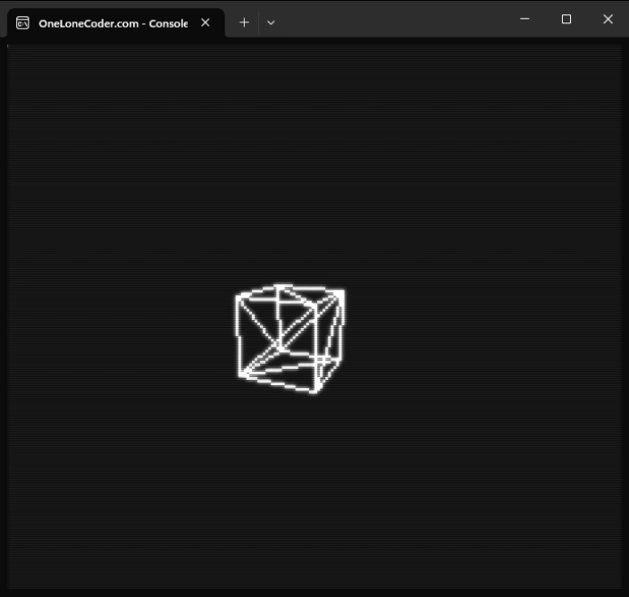

# Rotating Cube - C++ with Pixel Game Engine

## Overview

This project is a simple 3D rotating cube implemented in C++ using the olcPixelGameEngine. The primary goal is to study fundamental concepts of computer graphics, such as 3D transformations, projection, and rendering, by implementing a basic 3D engine.

The project is inspired by the video tutorial from JavidX9: "Code-It-Yourself! 3D Graphics Engine".

## References

- JavidX9 - One Lone Coder YouTube Channel

- olcPixelGameEngine Documentation

